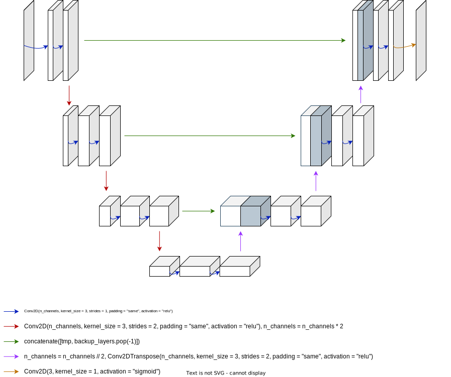

# CIFAR-10 Deblurring

The aim of this project is to present a solution to an image deblurring task. In particular, the specifics of the problem require one to deblur an already blurred version of the CIFAR-10 dataset. To solve such problem (up to a certain MSE score and a certain accuracy), a specific neural network (namely a U-Net) has been implemented and trained by using the provided training set. Moreover, the performances of the model have been measured by computing the mean squared error (MSE) between the predicted set of images and the given test set of images. Based on the achieved results, the final MSE score on the provided test set is `0.002185386799743028`.

## Neural Nerwork

In order to tackle the proposed image deblurring problem, a U-Net has been used. This network has the following architecture:

  

Please see [network.ipynb](https://github.com/MatteoDonati/deblurring_CIFAR10/blob/main/notebook.ipynb) for more information about the specific neural network.
